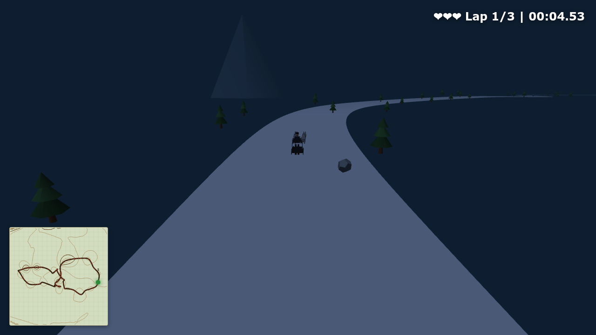

# Cani da Slitta

A 3D husky sled racing game that runs entirely in the browser.

## Play

**[Play now](https://albusdemens.github.io/canidaslitta/)**

Arrow keys or WASD to steer. Space to start. Dodge trees and rocks on a 2km figure-8 circuit. Complete 3 laps to win.

You get 3 lives — each hit slows you down.

## Features

- 8 animated huskies pulling a sled through a snowy night
- Two-body physics: steer the dogs, the sled follows on a tether
- Rolling hills with slope-based speed (gravity)
- Topographic contour minimap
- Aurora borealis night sky with stars and snow
- Procedural audio: sled sounds, wind, husky howls
- Lap timer with best lap tracking
